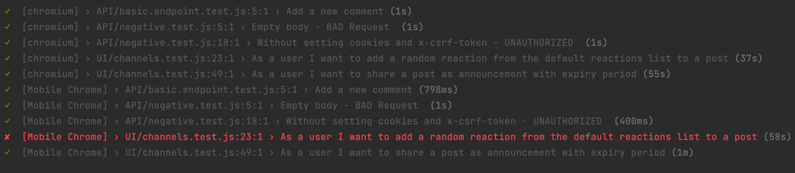

# Playwright-UI-API-Framework

## Technologies
* JavaScript
* Playwright
* Winston
* Docker
* GitHub Actions

## Setup project locally
* Install dependencies - 'npm install'
* Run the test - 'npx playwright test'
* To run the test parallel - Go to 'playwright.config.js' and increase the workers.

playwright.config.js has the general configurations of the framework. (Eg- BaseURL, Header values, timeout, report type, number of workers (parallel run))

## Report
* Report can be found in the '**playwright-report**' directory
* Video of the play is getting recorded in '**test-results**' directory under test name, if the test fails.

## Run Docker Image

Build the image and run tests.
* docker build -t playwright-framework .

## Assigment Solution Description

## Encountered Issues 
1. Home page was taking some time to load. I had to use **waitForURL** to handle the Home page loading.
2. I initially used **Page Object Model** by define page classes. Then I switch to a **Data driven approach** using json. Since it is more readable compare to POM in this scenario.  Implementation can be found in the **mappings** directory.
3. When selecting random reactions, I had to use Math.random() function which I defined in support directory.
4. When selecting the '1 week' option from 'Announcement Expiry' I couldn't really inspect the dropdown elements. Since it was an input, I passed the dropdown value as text element to locate the value. And it worked.
5. After landing on the home page, google oath2 is redirected and ask me to select the login account on a new window. I tried to disable the browser options of opening a new window, but it didn't work. Still I was able to run the tests.
6. For API automation - I tried to extract and pass the cookies from browser context of playwright to the headers, but couldn't find a proper way to extract both cookies and x-csrf-token. So I had to hard code the header with cookies and x-csrf-token. 

## Bugs
Emulator Mobile chrome mode - post reaction icon panel is NOT getting loaded.

